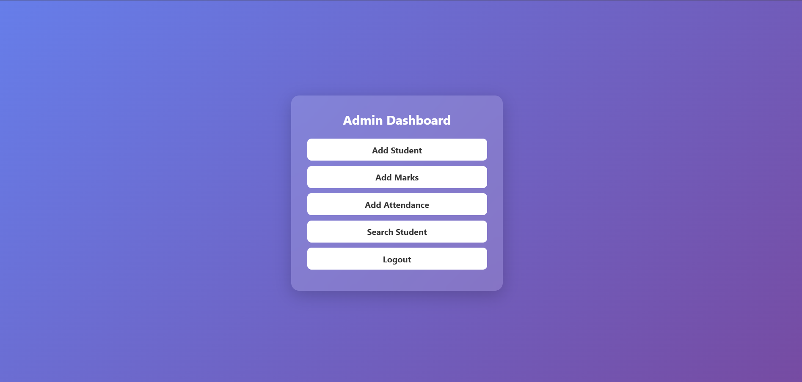

## 📸 Project Screenshots  

  

  

# 🎓 Student Management System  

🚀 A fully functional **web-based Student Management System** developed using PHP & MySQL and successfully deployed online.

## 📌 About The Project  

This project is designed to manage student records efficiently through an admin dashboard.  
It allows administrators to securely log in, add students, view records, and manage data through a connected MySQL database.

🔗 **Live Website:**  
http://studentproject.wuaze.com/student_management/

## ✨ Key Features  

✔️ Secure Admin Login  
✔️ Add New Students  
✔️ View Student Records  
✔️ Database Integration (MySQL)  
✔️ Hosted Live on InfinityFree  

## 🛠 Tech Stack  

- **Frontend:** HTML, CSS  
- **Backend:** PHP  
- **Database:** MySQL  
- **Local Development:** XAMPP  
- **Hosting:** InfinityFree  
- **Version Control:** Git & GitHub  

---

## 🎯 Project Highlights  

- Developed and tested locally using XAMPP  
- Successfully deployed on a live hosting server  
- Implemented database connectivity using MySQLi  
- Managed version control using Git  

## 👨‍💻 About Me  

**Vedant Wasalwar**  
🎓 B.Tech CSE Student  
💻 Passionate about Web Development & Backend Systems  

📧 Email: vedantwasalwar43@gmail.com  

---

⭐ If you like this project, feel free to give it a star!
